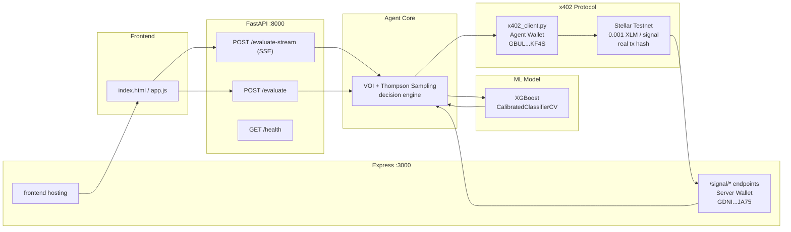

<div align="center">


# SCORYTHM

### Fraud Intelligence Agent

**An AI agent that knows when it doesn't know — and pays for the answer on Stellar.**

Uncertainty-aware fraud detection with autonomous signal purchasing  
via x402 micropayments on Stellar testnet — every decision is on-chain.

---


</div>

---

## The Problem

Most fraud detection systems are **static**. They apply a fixed threshold to a probability score and call it a day. This creates two compounding failures:

| Issue | Consequence |
|-------|-------------|
| Fixed thresholds | Decisions made with equal confidence in easy and hard cases |
| Always-on data enrichment | Pay for external data even when the model is already certain |
| No uncertainty quantification | No way to distinguish `p=0.30` (likely legit) from `p=0.48` (genuinely unclear) |

The result: either too many false positives (blocking legitimate customers) or too many false negatives (letting fraud through). **Neither is free.**

---

## The Solution

Scorythm is not a classifier. It is an **economic decision system**.

> Only pay for external data when the cost of uncertainty exceeds the cost of the data.

```
Model is confident  →  decide immediately (zero signal cost)
Model is uncertain  →  buy the most valuable signal per dollar  →  decide
```

This isn't a trade-off between speed and accuracy. It's a rational allocation of information costs.

---

## Why x402 on Stellar

Scorythm uses the [x402 protocol](https://x402.org) to pay for data on-demand — one micropayment per signal, per query, with no subscriptions.

Signal costs range from **$0.001 to $0.003**. At Ethereum gas prices, each signal purchase would cost $2–$15 in fees alone — making per-query payments economically impossible. Stellar's flat **0.00001 XLM fee** (~$0.000003) makes the entire model viable.

```
Agent  →  GET /signal/tx-velocity  →  Signal Server
       ←  HTTP 402 PAYMENT-REQUIRED (XLM amount + destination)
       →  Stellar payment tx (real XLM, testnet)
       →  retry with payment-signature header
       ←  signal data (velocity_flag, anomaly_detected, ...)
```

**Key properties:**
- **HTTP 402** — Standard protocol. Server returns payment requirements, agent fulfills them autonomously
- **XLM native** — `0.001 XLM` per signal, no trustlines required
- **Per-query** — No subscription. Pay only when the agent decides it's worth it
- **Anti-replay** — Each tx hash can only be used once
- **Two-wallet architecture** — Agent wallet pays, signal server wallet receives (verifiable on-chain)
- **Real transactions** — Every signal purchase is a real Stellar testnet tx, visible in the explorer

### Live Transactions

Agent wallet (pays for signals):  
https://stellar.expert/explorer/testnet/account/GBULNFYDNJNDW2HLRJWVWQDYVPP5PDEJ56POOQXACD575GHQXQMGKF4S

Signal server wallet (receives payments):  
https://stellar.expert/explorer/testnet/account/GDNIWY6TITEJEUC7O7TTGQME45C2WOILUIVDJZICPC47R43NU5UFJA75

Every signal purchase generates a real XLM transaction on Stellar testnet, visible in the explorer above.

---

## How It Works

```
Transaction (6 features)
        │
        ▼
┌─────────────────────┐
│  Calibrated XGBoost  │  ← Probabilistic inference
│  prob_fraud + CI     │  ← 95% Confidence Interval
└──────────┬──────────┘
           │
           ▼
    ┌──────────────┐
    │  Risk Zone    │  CI contains 0.5?
    │  Assessment   │
    └───────┬──────┘
            │
     ┌──────┴──────┐
     │              │
    Yes            No
     │              │
     ▼              ▼
┌─────────┐    DECIDE IMMEDIATELY
│ VOI +   │    p ≥ 0.65 → FRAUD
│ Bandit  │    p ≤ 0.35 → LEGITIMATE
│ select  │
└────┬────┘
     │
     ▼
┌──────────────────┐
│ x402 micropayment │  ← Real Stellar payment (XLM)
│ to signal server  │  ← Verifiable on Stellar testnet
└──────┬───────────┘
       │
       ▼
┌──────────────────┐
│ Update fraud      │  ← Probability adjusted by signal data
│ probability       │
└──────┬───────────┘
       │
       ▼
    DECIDE
    p ≥ 0.55 → FRAUD
    p ≤ 0.45 → LEGITIMATE
    else     → UNCERTAIN
```

### Step-by-step

1. **Predict** — XGBoost returns calibrated fraud probability + 95% confidence interval
2. **Gate** — If CI contains 0.5, enter signal purchase mode (ambiguous zone)
3. **Score** — Compute VOI (Value of Information) for each available signal
4. **Select** — Thompson Sampling bandit adjusts priorities based on past signal performance
5. **Purchase** — Buy the highest VOI signal via x402 micropayment on Stellar (XLM)
6. **Update** — Adjust fraud probability based on signal data
7. **Decide** — Apply thresholds (looser before signals, tighter after)

---

## Uncertainty Quantification

The model doesn't just return a score. It returns a **confidence interval**:

```
uncertainty = 1 - |2p - 1|
```

| prob_fraud | uncertainty | Interpretation |
|------------|-------------|----------------|
| 0.05 | 0.10 | Certain — likely legitimate |
| 0.30 | 0.40 | Reasonably confident |
| 0.50 | 1.00 | Maximum uncertainty |
| 0.70 | 0.40 | Reasonably confident |
| 0.90 | 0.20 | Certain — likely fraud |

The agent only buys signals when `uncertainty > 0.30` (i.e., `prob ∈ (0.35, 0.65)`).

---

## Value of Information (VOI)

VOI answers: **"Is this signal worth buying?"**

```
VOI = expected_loss_reduction − signal_cost
```

Expected loss is computed with **asymmetric costs** — letting fraud through (`C_FN = 1.0`) costs more than blocking a legitimate transaction (`C_FP = 0.1`).

$$
L_{\text{before}} = L(p) = p \cdot C_{FN} + (1 - p) \cdot C_{FP}
$$

$$
VOI = L_{\text{before}} - L_{\text{after}} - \text{cost}
$$

If `VOI > 0`, the signal pays for itself. The agent buys signals with positive VOI.

### Signal Catalog

| Signal | Cost | Utility | Data Provided |
|--------|------|---------|---------------|
| `ip-reputation` | $0.001 | 0.72 | VPN, Tor, country, abuse reports |
| `tx-velocity` | $0.002 | 0.81 | Velocity score, anomaly flags |
| `device-history` | $0.003 | 0.88 | Fraud flags, linked accounts, risk tier |

---

## Thompson Sampling Bandit

The agent **learns which signals work best over time**.

Each signal maintains a Beta distribution:
- `alpha` — times the signal helped escape the uncertain zone
- `beta` — times it didn't

On each evaluation, the agent samples from each Beta distribution and multiplies by VOI. This balances **exploration** (try signals we don't know well) with **exploitation** (use signals that have worked before).

State persists between evaluations in `data/bandit_state.json`.

---

## Architecture



---

## Tech Stack

| Layer | Technology |
|-------|------------|
| ML Model | XGBoost 2.x + scikit-learn `CalibratedClassifierCV` (isotonic) |
| Uncertainty | Bootstrap + Conformal Prediction (95% CI) |
| Agent Logic | Python 3.12 — VOI + Thompson Sampling |
| API | FastAPI + Pydantic v2 + Uvicorn |
| Streaming | Server-Sent Events (SSE) |
| Signal Server | Node.js 20 + Express |
| Payments | x402 protocol — XLM on Stellar testnet |
| Frontend | Vanilla HTML/CSS/JS — no build step |
| Explainability | Claude API (Anthropic) — optional |

---

## Component Inventory

| File | Role |
|------|------|
| `model/train.py` | Generates 50k synthetic transactions, trains XGBoost, calibrates with isotonic CV |
| `model/predict.py` | Returns `prob_fraud`, `uncertainty`, `conf_low`, `conf_high` |
| `agent/agent.py` | Core loop: prediction → uncertainty gate → VOI → bandit → signal → decision + streaming |
| `agent/uncertainty.py` | `calculate_uncertainty()`, `is_uncertain()`, `expected_utility()` |
| `agent/bandit.py` | Thompson Sampling: Beta-distributed arms per signal |
| `agent/x402_client.py` | HTTP client with real Stellar SDK — XLM native payments, anti-replay |
| `agent/explainer.py` | Claude API integration for natural language explanations |
| `run_server.py` | Quick launcher for FastAPI server |
| `api/main.py` | FastAPI app: `POST /evaluate`, `POST /evaluate-stream`, `GET /health` |
| `api/schemas.py` | Pydantic v2 request/response models |
| `server/index.js` | Express server: 3 x402-protected signal endpoints, serves frontend |
| `frontend/index.html` | Dashboard UI — dark theme, pipeline visualization, financial metrics |
| `frontend/app.js` | Dashboard logic: streaming, AbortController, race condition guard, charts |

---

## Setup

```bash
# 1. Install Python dependencies
pip install -r requirements.txt

# 2. Install Node.js dependencies
cd server && npm install && cd ..

# 3. Configure environment
cp .env.example .env
# Edit .env:
#   STELLAR_ADDRESS=G...          (agent wallet — pays for signals)
#   STELLAR_SECRET=S...
#   SERVER_STELLAR_ADDRESS=G...   (server wallet — receives payments)
#   ANTHROPIC_API_KEY=sk-ant-...  (optional)

# 4. Train the model
python model/train.py

# 5. Start the FastAPI server (terminal 1)
python run_server.py

# 6. Start the signal server + frontend (terminal 2)
cd server && node index.js

# 7. Open the dashboard
# http://localhost:3000
```

---

## API

### POST /evaluate

```bash
curl -X POST http://localhost:8000/evaluate \
  -H "Content-Type: application/json" \
  -d '{
    "amount": 2500.0,
    "hour": 3,
    "country_mismatch": 1,
    "new_account": 1,
    "device_age_days": 2.0,
    "transactions_last_24h": 28
  }'
```

**Response:**

```json
{
  "prob_fraud": 0.7396,
  "uncertainty": 0.4792,
  "conf_low": 0.50,
  "conf_high": 0.97,
  "risk_zone": "AMBIGUOUS",
  "decision": "FRAUD",
  "signals_purchased": [
    {
      "signal_name": "tx-velocity",
      "cost_usd": 0.002,
      "data": { "velocity_flag": true, "transactions_24h": 47 },
      "tx_hash": "76c7d37a...",
      "prob_adjustment": 0.0341,
      "voi": 0.0812,
      "bandit_priority": 0.72
    }
  ],
  "total_cost": 0.003,
  "reasoning": "Initial model prediction: prob_fraud=0.7342...",
  "initial_prob_fraud": 0.7342,
  "elapsed_ms": 127.4
}
```

### POST /evaluate-stream

Streaming version via Server-Sent Events. Events:

| Event type | Description |
|------------|-------------|
| `step_start` | A pipeline step has started |
| `step_complete` | A step completed with data |
| `signal_start` | Signal purchase initiated |
| `signal_complete` | Signal purchased, probability updated |
| `explanation` | Claude natural language explanation |
| `done` | All processing complete |

### GET /health

Returns model metrics (ROC-AUC, average precision) and bandit state.

---

## Example Output

**Input — Uncertain transaction:**
```json
{
  "amount": 320.0,
  "hour": 22,
  "country_mismatch": 1,
  "new_account": 0,
  "device_age_days": 30.0,
  "transactions_last_24h": 7
}
```

**Output:**
```
Decision:  FRAUD
prob_fraud: 0.6812  (initial: 0.5210)
uncertainty: 0.3576  (initial: 0.9580)
CI: [0.35, 0.69]
risk_zone: AMBIGUOUS

Signals purchased:
  device-history  $0.003  VOI: +0.1204  adj: +0.0921  tx: a3f9c12b...
  ip-reputation   $0.001  VOI: +0.0681  adj: +0.0681  tx: 7e2d84fa...

Total cost: $0.004
Evaluation time: 234ms
```

---

## What's Implemented

| Feature | Status |
|---------|--------|
| Calibrated XGBoost model (ROC-AUC ~99%) | ✅ |
| Uncertainty quantification (95% CI) | ✅ |
| VOI-based signal selection | ✅ |
| Thompson Sampling bandit | ✅ |
| Real x402 payments via Stellar SDK | ✅ |
| XLM native payments (no trustlines) | ✅ |
| Two-wallet architecture (agent pays → server receives) | ✅ |
| Anti-replay protection | ✅ |
| SSE streaming pipeline | ✅ |
| AbortController + race condition guard | ✅ |
| Full reasoning trace | ✅ |
| Interactive dashboard with pipeline view | ✅ |
| Probability evolution chart (SVG) | ✅ |
| Counterfactual analysis | ✅ |
| Economic impact calculator | ✅ |
| Evidence flow visualization | ✅ |
| Bandit state persistence | ✅ |
| Claude AI explanations (optional) | ✅ |
| Real Stellar testnet transactions (XLM) | ✅ |
| IPQualityScore real IP reputation API | ✅ |
| Live transaction explorer links | ✅ |

---

## What's Next

| Priority | Item |
|----------|------|
| High | Stellar mainnet integration |
| High | Dynamic signal marketplace (any provider can register) |
| Medium | Multi-chain x402 (expand beyond Stellar) |
| Medium | ZK proofs for model execution integrity |
| Low | MCP tool exposure for other AI agents |

---

## The Core Principle

> Don't pay for data unless uncertainty justifies it.

Every transaction evaluated by Scorythm follows the same logic a rational analyst would follow: if you're already sure, decide. If you're not, figure out what's worth knowing — and whether it's worth paying for.

That's not a ML pipeline. That's a **decision system with a budget** — and every budget decision is settled on Stellar.

---

<div align="center">

Built for **Stellar Hacks 2026** · MIT License

</div>
